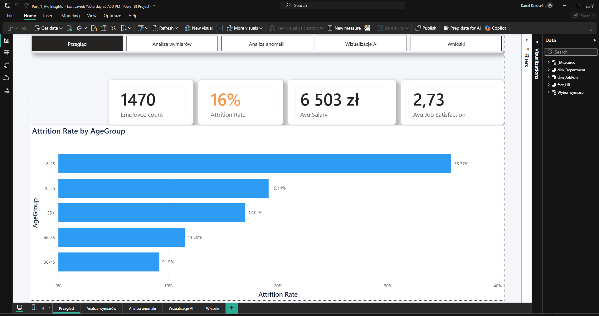
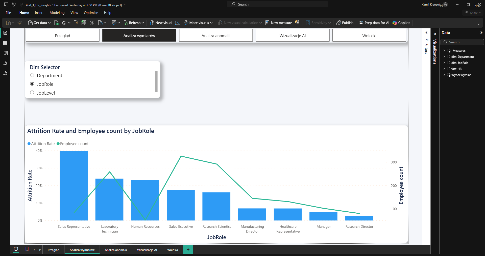
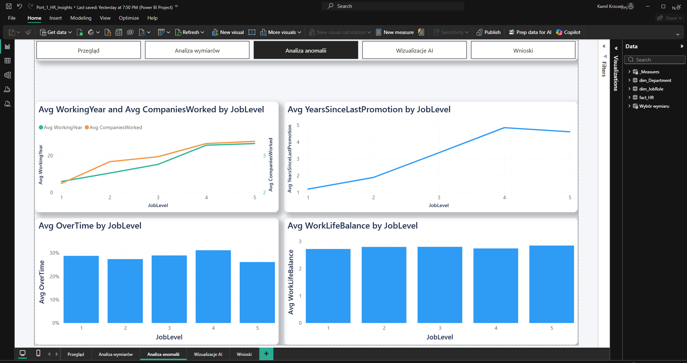
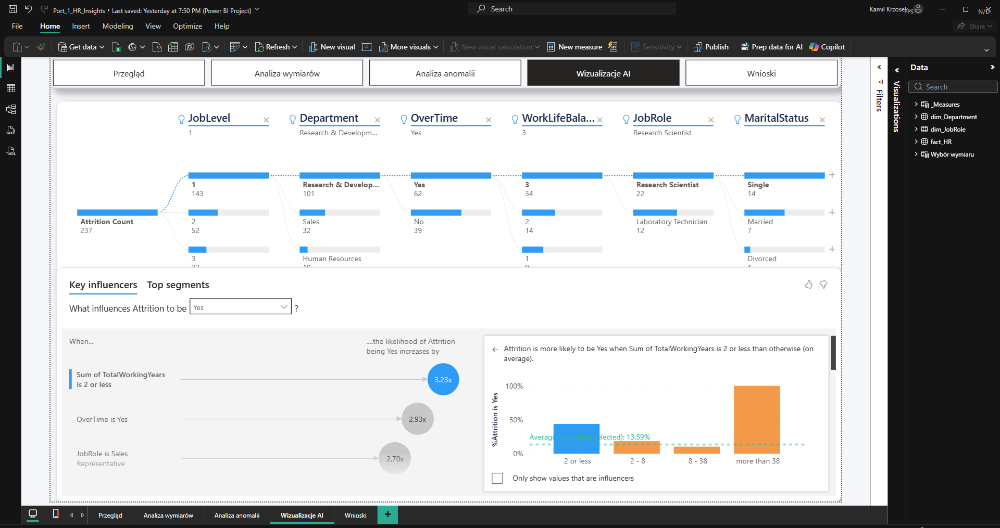
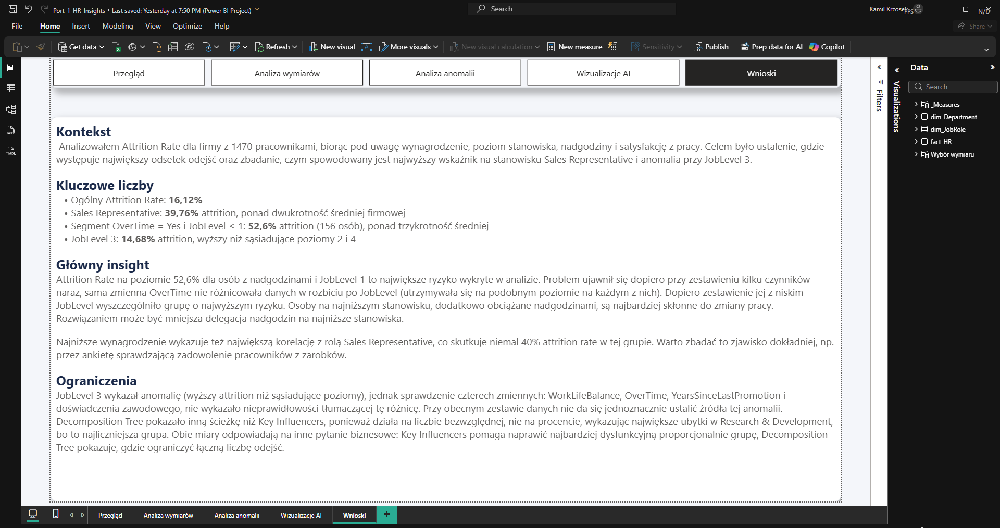

*[Read this in English](README.en.md)*

# HR Analytics: analiza rotacji pracowników (Power BI)

Interaktywny raport Power BI analizujący rotację pracowników (*attrition*) w oparciu o zbiór danych IBM HR Analytics Employee Attrition (1 470 pracowników). Projekt nie kończy się na zbudowaniu wykresów. Jego trzonem jest udokumentowany proces dochodzeniowy: hipoteza, weryfikacja, odrzucenie, kolejna hipoteza, aż do znalezienia segmentu o realnie podwyższonym ryzyku odejścia.

**Plik projektu:** [`Port_1_HR_Insights.pbix`](Port_1_HR_Insights.pbix) (pojedynczy plik, otwórz bezpośrednio w Power BI Desktop)

---

## Podgląd raportu

| Przegląd | Analiza wymiarów |
|---|---|
|  |  |

| Analiza anomalii | Wizualizacje AI |
|---|---|
|  |  |

**Wnioski**


---

## 1. Pytanie biznesowe

Gdzie w organizacji rotacja pracowników jest najwyższa, jakie czynniki się z nią wiążą, i czy da się wskazać konkretny, precyzyjnie zdefiniowany segment pracowników wysokiego ryzyka, a nie tylko ogólne korelacje.

## 2. Dane

- **Źródło:** [IBM HR Analytics Employee Attrition & Performance](data/HR_Analytics.csv) (powszechnie znany, publicznie dostępny zbiór demonstracyjny, dołączony w repo w folderze [`data/`](data/)).
- **Surowe dane:** 1 480 wierszy pracowników.
- **Czyszczenie (Power Query):**
  - usunięto 7 w pełni zduplikowanych wierszy (`Table.Distinct` na całym wierszu),
  - usunięto kolejne 3 wiersze z powtórzonym `EmpID` przy różniących się pozostałych kolumnach (`Table.Distinct` po `EmpID`),
  - **wynik: 1 470 unikalnych pracowników** (zweryfikowane bezpośrednio w pliku źródłowym i zgodne z miarą `Employee count` w raporcie),
  - usunięto kolumny bez wariancji: `EmployeeCount`, `StandardHours`, `Over18`,
  - dodano kolumnę pomocniczą `SalarySlab Key` (custom column, warunek if/then), bo tekstowe kategorie widełek wynagrodzeń (np. „Upto 5k”) sortowały się alfabetycznie, a nie logicznie.

## 3. Model danych

Star schema zamiast jednej płaskiej tabeli:

```
dim_Department ──┐
                  ├──► fact_HR ──► _Measures (tabela miar DAX)
dim_JobRole ──────┘
```

- Klucze `Department Key` / `JobRole Key` zbudowane ręcznie w Power Query: referencja do tabeli faktów → unikalne wartości → `Remove Duplicates` → `Add Index Column` → `Merge` z powrotem do `fact_HR`. Klucze są liczbowe (surogatne), nie tekstowe.
- Relacje 1\:wiele, filtrowanie jednokierunkowe.
- **Świadomie NIE zbudowano `dim_Employee`**: relacja byłaby 1:1 z `fact_HR`, więc nie dałaby żadnej korzyści star schema (tylko sztuczne rozbicie jednej tabeli na dwie).
- Dynamiczny wybór wymiaru na stronie 2 zrealizowany przez **Field Parameter** (`Dim Selector`), a nie zwykły slicer (patrz sekcja 5).
- Tabela miar nazwana `_Measures` (z podkreśleniem).

## 4. Miary DAX (wybrane)

| Miara | Definicja | Wynik (total) |
|---|---|---|
| `Attrition Rate` | `DIVIDE(CALCULATE(COUNTROWS(fact_HR), fact_HR[Attrition]="Yes"), COUNTROWS(fact_HR), 0)` | 16,12% |
| `Avg Salary` | `AVERAGE(fact_HR[MonthlyIncome])` | 6 503 zł |
| `Avg OverTime` | `DIVIDE(CALCULATE(COUNTROWS(fact_HR), fact_HR[OverTime]="Yes"), COUNTROWS(fact_HR), 0)` | 28,30% |
| `Employee count` | `COUNTROWS(fact_HR)` | 1 470 |
| `Avg Job Satisfaction` | `AVERAGE(fact_HR[JobSatisfaction])` | 2,73 |

Konsekwentnie użyto `DIVIDE(...,...,0)` zamiast dzielenia operatorem `/`, żeby uniknąć błędów przy dzieleniu przez zero w widokach silnie odfiltrowanych.

## 5. Struktura raportu

| Strona | Zawartość | Kluczowa decyzja projektowa |
|---|---|---|
| **1. Przegląd** | Karty KPI (Employee Count, Attrition Rate, Avg Salary, Avg Job Satisfaction) + Attrition Rate wg grupy wiekowej | Karta Attrition Rate celowo wyróżniona kolorem jako główny temat raportu |
| **2. Analiza wymiarów** | Jeden wykres (Attrition Rate + Employee Count), przełączany między Department / JobRole / JobLevel | **Field Parameter** zamiast slicera (patrz niżej) |
| **3. Analiza anomalii** | 4 wykresy badające anomalię JobLevel 3 (WorkLifeBalance, OverTime, YearsSinceLastPromotion, WorkingYear+CompaniesWorked) | Typ wykresu dobrany do charakteru danych: słupki dla porównań bez trendu, linie dla trendu wzdłuż uporządkowanej skali |
| **4. Wizualizacje AI** | Key Influencers, Top Segments, Decomposition Tree | Wykorzystanie wbudowanych narzędzi AI Power BI, jawnie odróżnione od ręcznej analizy DAX |
| **5. Wnioski** | Podsumowanie tekstowe: kontekst, kluczowe liczby, główny insight, ograniczenia | Uczciwe nazwanie granic analizy, nie tylko „sukcesów” |

**Field Parameter zamiast slicera (strona 2):** zwykły slicer *filtruje wiersze*. Field Parameter *zmienia, którą kolumnę w ogóle pokazuje wizualizacja* (mechanizm `NAMEOF` + `SELECTEDVALUE`). Dzięki temu jeden wykres obsługuje trzy różne wymiary bez duplikowania wizuali, a tytuł wykresu aktualizuje się dynamicznie. Slicer ustawiony na single-select: przy multi-select (ustawienie domyślne) wybranie kilku wymiarów naraz dawało wyniki bez sensu.

```dax
Dim Selector =
{
    ("Department", NAMEOF('dim_Department'[Department]), 0),
    ("JobRole",    NAMEOF('dim_JobRole'[JobRole]),        1),
    ("JobLevel",   NAMEOF('fact_HR'[JobLevel]),           2)
}
```

## 6. Proces dochodzeniowy: najważniejsza część projektu

### Krok 1. Pierwszy trop: JobRole

`Sales Representative` ma najwyższy Attrition Rate (39,76%) i najniższe średnie wynagrodzenie (2 626 zł) spośród wszystkich ról. Na pierwszy rzut oka: niższa pensja → wyższa rotacja, zależność wygląda liniowo.

### Krok 2. Weryfikacja przez JobLevel (hipoteza upada)

| JobLevel | Attrition Rate | Liczba osób | Śr. wynagrodzenie |
|---|---|---|---|
| 1 | 26,34% | 543 | 2 786 zł |
| 2 | 9,74% | 534 | 5 502 zł |
| **3** | **14,68%** ⚠️ | 218 | 9 817 zł |
| 4 | 4,72% | 106 | 15 503 zł |
| 5 | 7,25% | 69 | 19 191 zł |

Poziom 3 **łamie wzorzec**: jego Attrition Rate jest wyższy niż u sąsiednich poziomów 2 i 4, mimo że wynagrodzenie rośnie monotonicznie. Zależność płaca/rotacja nie jest więc tak liniowa, jak sugerował sam JobRole.

### Krok 3. Metodyczne odrzucanie hipotez dla anomalii JobLevel 3

Sprawdzone i **odrzucone** jako wyjaśnienie:

- `WorkLifeBalance`: płasko 2,71–2,84 na wszystkich poziomach, brak różnicy,
- `OverTime`: płasko 26–31% na wszystkich poziomach, brak różnicy,
- `YearsSinceLastPromotion`: rośnie liniowo z JobLevel (1,19 → 4,84), poziom 3 nie odstaje, a kierunek zależności jest odwrotny do hipotezy,
- `TotalWorkingYears` i `NumCompaniesWorked`: również rosną liniowo z JobLevel, poziom 3 nie odstaje.

**Uczciwy wniosek:** liczebność grupy (218 osób, 32 odejścia) jest wystarczająca, żeby wykluczyć szum statystyczny. To nie przypadek. Ale przy dostępnych zmiennych **nie udało się jednoznacznie ustalić przyczyny**. Możliwa kombinacja czynników spoza zbioru danych. Zamiast naciągać wyjaśnienie, raport wprost mówi „nie wiadomo”.

### Krok 4. Key Influencers na całej populacji (nie tylko JobLevel 3)

| Czynnik | Wzrost prawdopodobieństwa odejścia |
|---|---|
| `TotalWorkingYears` ≤ 2 | **3,23×** |
| `OverTime` = Yes | 2,93× |
| `JobRole` = Sales Representative | 2,70× |
| `YearsAtCompany` ≤ 1 | 2,70× |

**Obserwacja metodologiczna:** `OverTime` nie różnicował JobLevel 3 od sąsiadów w ręcznej analizie przekrojowej (płasko 26–31%), a jednocześnie jest jednym z najsilniejszych predyktorów w modelu na całej populacji. Brak różnicy *między konkretnymi grupami* nie oznacza, że zmienna nie ma znaczenia *ogólnie*: to dwa różne pytania.

### Krok 5. Top Segments: najsilniejszy insight projektu

> **Segment: `OverTime = Yes` AND `JobLevel ≤ 1`**
> **156 osób** (10,6% całej firmy) → **52,6% attrition**, 36 punktów procentowych powyżej średniej firmowej (16,1%).

To złożenie dwóch najsilniejszych pojedynczych czynników z Key Influencers: razem dają efekt większy niż suma osobnych obserwacji. **Ręczna analiza po samym JobLevel tego nie wykryła**, bo patrzyła na zmienną w izolacji. Dopiero przecięcie dwóch wymiarów naraz (OverTime × JobLevel) ujawnia grupę realnie wysokiego ryzyka. To wniosek, który faktycznie da się przekuć w rekomendację dla HR (np. ograniczenie nadgodzin na najniższych stanowiskach).

### Krok 6. Decomposition Tree: dwie różne ścieżki, dwa różne pytania

- **Ścieżka wg proporcji (Attrition Rate):** Department = Sales (20,63%) → JobRole = Sales Representative (39,76%) → OverTime (Yes: 66,67% / No: 28,81%). Potwierdza trop z Kroku 1.
- **Ścieżka wg liczb bezwzględnych (Attrition Count, drążenie do 6 poziomów):** JobLevel = 1 → Department = Research & Development → OverTime = Yes → WorkLifeBalance = 3 → JobRole = Research Scientist → MaritalStatus = Single (14 osób na końcu ścieżki).

Te dwie ścieżki **nie są sprzeczne: odpowiadają na różne pytania**. Research & Development ma po prostu więcej pracowników niż Sales, więc dominuje w liczbach bezwzględnych mimo niższego wskaźnika procentowego. Praktyczna implikacja dla HR: *rate* wskazuje, gdzie proporcjonalnie jest najgorzej (Sales Representative), *count* wskazuje, gdzie w liczbach bezwzględnych firma traci najwięcej ludzi (JobLevel 1 / R&D). To dwie różne, uzupełniające się decyzje biznesowe, nie jedna „prawidłowa” odpowiedź.

**Zastrzeżenie o małej próbie:** drążenie na 6 poziomów prowadzi do bardzo małych grup (14 osób). Decomposition Tree dobrze nadaje się do eksploracji, ale wnioski na tak głębokim poziomie tracą wiarygodność statystyczną i nie powinny być podstawą decyzji bez dalszej weryfikacji.

## 7. Warstwa wizualna

Oprócz warstwy analitycznej raport przeszedł osobny przegląd wizualny, w tym:

- naprawiono błąd w palecie kolorów motywu: czysta biel jako jeden z kolorów danych powodowała, że 4. kategoria na wykresach (np. JobLevel) była **niewidoczna** na białym tle karty,
- dodano spójne zaokrąglone rogi, subtelny cień i ramki wizuali (efekt głębi zamiast płaskiego wyglądu),
- ujednolicono niespójne formatowanie jednej z kart KPI względem pozostałych,
- dodano odstępy między wizualami, które wcześniej stykały się krawędziami,
- dobór typu wykresu na stronie 3 (słupki vs linie) jest świadomą decyzją komunikującą charakter danych, nie przypadkiem.

## 8. Ograniczenia

- Analiza ma charakter korelacyjny, nie przyczynowo-skutkowy: dane nie pozwalają dowieść mechanizmu przyczynowego, tylko wskazać powiązania.
- Anomalia JobLevel 3 pozostaje niewyjaśniona przy dostępnych zmiennych: świadomie zaraportowana jako otwarty problem, a nie naciągnięta na siłę.
- Małe liczebnościowo kategorie (np. JobRole = Human Resources, Manager, Research Director) mają skrajne wartości Attrition Rate i wymagają ostrożnej interpretacji.
- Nieprzebadany jeszcze trop dalszy: `MaritalStatus` (w segmencie wysokiego ryzyka stan cywilny „Single” stanowi 37,8% i wg AI „najbardziej wpływa na rozkład”), potencjalny trzeci wymiar segmentu do zbadania.

## 9. Użyte umiejętności

Power Query (czyszczenie, budowa kluczy, kolumny niestandardowe) · modelowanie gwiazdy · DAX (`CALCULATE`, `DIVIDE`, `AVERAGE`, `COUNTROWS`) · Field Parameters · Key Influencers i Decomposition Tree (AI visuals) · świadomy dobór typu wykresu · stylizacja raportu (motyw JSON, spójność wizualna) · higiena nazewnictwa modelu danych.

## 10. Jak otworzyć

1. Wymagany Power BI Desktop.
2. Otwórz `Port_1_HR_Insights.pbix`: to pojedynczy, samodzielny plik z już wczytanymi danymi, więc otworzy się od razu bez dodatkowej konfiguracji.
3. Surowe dane źródłowe (`data/HR_Analytics.csv`) są dołączone osobno w repo dla przejrzystości. Jeśli chcesz odświeżyć dane w pliku (Refresh) po sklonowaniu repo w inne miejsce, zaktualizuj ścieżkę w Power Query (Transformuj dane → zapytanie `HR_Analytics` → krok `Source`).

---

**Źródło danych:** IBM HR Analytics Employee Attrition & Performance (publicznie dostępny zbiór demonstracyjny).
