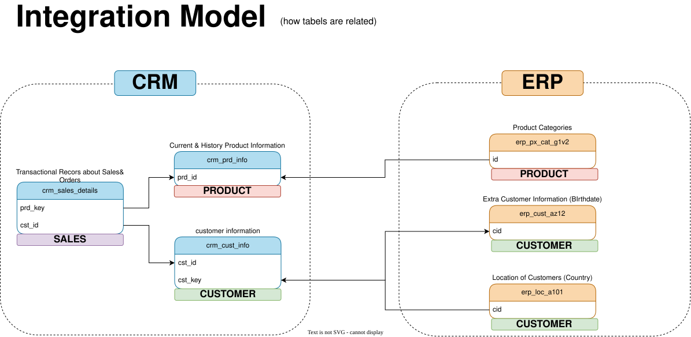
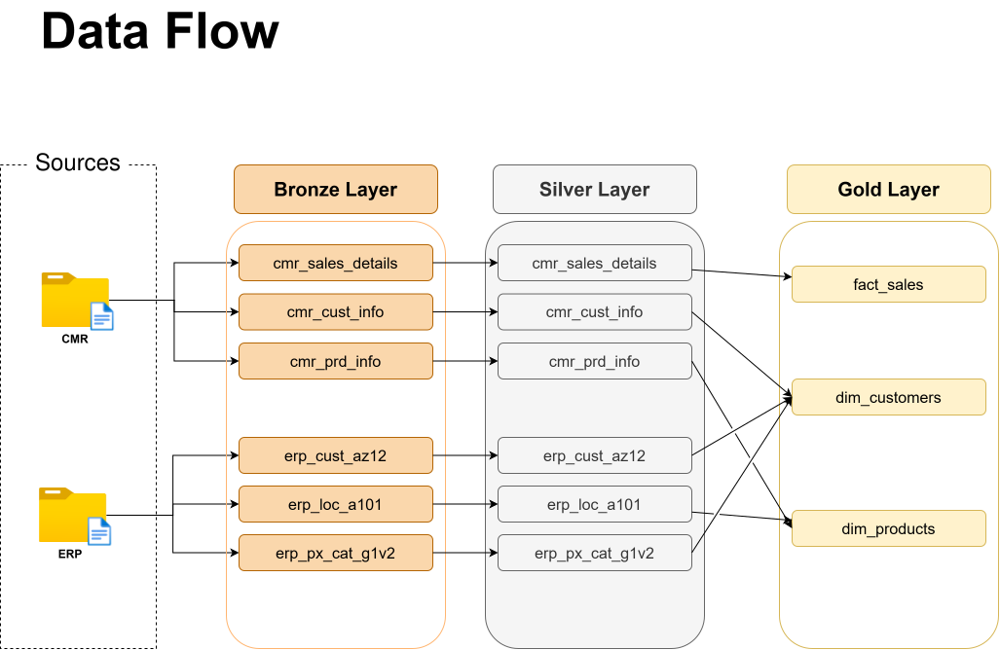

*[Czytaj po polsku](README.md)*

# SQL Data Warehouse: raw CSV to a star schema (SQL Server)

A complete data pipeline built in SQL Server: from raw CSV files coming out of two independent systems (CRM and ERP), through cleaning and standardization, to a report-ready star schema.

---

## Table of contents

1. [Project goal](#1-project-goal)
2. [Data architecture](#2-data-architecture)
3. [Data sources](#3-data-sources)
4. [Bronze layer](#4-bronze-layer)
5. [Silver layer: where the real work happens](#5-silver-layer-where-the-real-work-happens)
6. [Gold layer: star schema](#6-gold-layer-star-schema)
7. [Data quality tests](#7-data-quality-tests)
8. [Repository structure](#8-repository-structure)
9. [How to run this project](#9-how-to-run-this-project)
10. [Limitations and possible next steps](#10-limitations-and-possible-next-steps)
11. [Skills demonstrated](#11-skills-demonstrated)

---

## 1. Project goal

A company's customer and sales data is scattered across two independent systems: CRM and ERP. Before anything can be computed (sales by country, by product category, by customer segment), the data has to be merged into one consistent model, fixing mismatches along the way: different key formats, missing prices, typo-prone gender and marital status codes, products with no expiration date.

Goal: design and build a data warehouse using medallion architecture (Bronze / Silver / Gold) that ends in a single, clean star schema ready for BI and ad-hoc queries, with no need to manually clean the data every time.

## 2. Data architecture


Three layers, each with a clearly defined responsibility:

- **Bronze**: raw data, exactly as it appears in the source files. Zero transformations. This layer's only job is a fast, repeatable load from CSV into the database (`BULK INSERT`, full reload on every run).
- **Silver**: data after cleaning, code standardization, format normalization, and fixing obvious errors. This is where all the ETL logic lives.
- **Gold**: SQL views modeling the data as a star schema, ready to be queried directly by BI tools. No extra loading step, since these are plain views over silver.

## 3. Data sources

Two independent systems, six CSV files totaling around 116k rows (see [`datasets/`](datasets/)):

| System | Files | Content |
|---|---|---|
| CRM | `cust_info.csv`, `prd_info.csv`, `sales_details.csv` | customers, products, sales order line items |
| ERP | `CUST_AZ12.csv`, `LOC_A101.csv`, `PX_CAT_G1V2.csv` | birthdate and gender, customer country, product categories |

The two systems don't share a key in a single consistent format: CRM identifies a customer via `cst_key` (e.g. `AW00011000`), while ERP uses `cid` in two different variants (`NASAW00011000` in one file, `AW-00011000` with a hyphen in the other): these mismatches are exactly what had to be reconciled in the silver layer.



## 4. Bronze layer

Six tables, one per source file, with no transformations at all. Columns are typed just enough for the data to fit (e.g. dates in `crm_sales_details` stay as `INT` in `YYYYMMDD` format, because that's how they look in the source). Loading is handled by the `bronze.load_bronze` procedure: for each table, `TRUNCATE` followed by `BULK INSERT` straight from the CSV file.

Files: [`scripts/bronze/ddl_bronze.sql`](scripts/bronze/ddl_bronze.sql), [`scripts/bronze/proc_load_bronze.sql`](scripts/bronze/proc_load_bronze.sql).

## 5. Silver layer: where the real work happens

This is the core of the project. Below are the concrete problems found in the source data and how the `silver.load_silver` procedure resolves them ([`scripts/silver/proc_load_silver.sql`](scripts/silver/proc_load_silver.sql)):

| Data problem | Fix |
|---|---|
| The same customer has multiple rows in `crm_cust_info` (updates overwriting each other over time) | `ROW_NUMBER() OVER (PARTITION BY cst_id ORDER BY cst_create_date DESC)`, keep only the most recent row |
| Marital status and gender encoded as single letters (`S`, `M`, `F`) | `CASE` translating codes into readable values (`Single`, `Married`, `Female`...), with `n/a` for anything unrecognized |
| Products in `crm_prd_info` have no end date, just successive rows with a new start date | `LEAD()` computes the end date as the day before the next version of the same product starts |
| `sls_sales` is sometimes `NULL`, negative, or inconsistent with `quantity * price` | recomputed from `quantity * ABS(price)` whenever the original value looks suspect |
| `sls_price` is sometimes `NULL` or negative | derived from `sales / quantity` when the price is missing |
| Some ERP customer IDs carry a stray `NAS` prefix | `SUBSTRING` strips the prefix to match the CRM format |
| ERP country codes are inconsistent (`DE`, `US` / `USA`, empty strings) | `CASE` mapping to full country names, empty and `NULL` mapped to `n/a` |
| Birthdates set in the future | replaced with `NULL` instead of keeping an impossible value |

All of these rules are enforced again by the tests in [`tests/quality_checks_silver.sql`](tests/quality_checks_silver.sql), so any regression shows up immediately.

## 6. Gold layer: star schema


Two dimensions and one fact table, implemented as SQL views (not physical tables: at this data volume there's no reason to materialize them):

- `gold.dim_customers`: merges CRM (core customer data) with ERP (country, birthdate, gender fallback when CRM doesn't know it).
- `gold.dim_products`: the current version of each product (`prd_end_dt IS NULL`), enriched with category and subcategory from ERP.
- `gold.fact_sales`: order line items joined to both dimensions via surrogate keys, not the source system's natural identifiers.

Full column catalog: [`docs/data_catalog.md`](docs/data_catalog.md). Naming conventions used throughout the project: [`docs/naming_conventions.md`](docs/naming_conventions.md).



## 7. Data quality tests

Two sets of control queries, each with a clearly stated expected result:

- [`tests/quality_checks_silver.sql`](tests/quality_checks_silver.sql): duplicate or `NULL` primary keys, unwanted whitespace, `sales = quantity * price` consistency, date range checks.
- [`tests/quality_checks_gold.sql`](tests/quality_checks_gold.sql): surrogate key uniqueness in the dimensions, referential integrity between `fact_sales` and the dimensions (no orphaned keys).

## 8. Repository structure

```
sql-data-warehouse/
│
├── datasets/                    # raw CSV files (CRM and ERP)
│   ├── source_crm/
│   └── source_erp/
│
├── docs/                        # documentation and diagrams
│   ├── data_architecture.png
│   ├── data_flow.svg
│   ├── data_integration.svg
│   ├── data_model.svg
│   ├── data_catalog.md
│   └── naming_conventions.md
│
├── scripts/                     # SQL scripts
│   ├── init_database.sql
│   ├── bronze/
│   ├── silver/
│   └── gold/
│
├── tests/                       # data quality checks
│
├── README.md
└── README.en.md
```

## 9. How to run this project

1. Requires SQL Server (the Express edition is enough) and SQL Server Management Studio.
2. Run [`scripts/init_database.sql`](scripts/init_database.sql): creates the `DataWarehouse` database and the three schemas.
3. Run the bronze and silver DDL scripts ([`scripts/bronze/ddl_bronze.sql`](scripts/bronze/ddl_bronze.sql), [`scripts/silver/ddl_silver.sql`](scripts/silver/ddl_silver.sql)) to create the empty tables.
4. In [`scripts/bronze/proc_load_bronze.sql`](scripts/bronze/proc_load_bronze.sql), update the `BULK INSERT` paths to the local path of the `datasets` folder after cloning this repo, then run the script and execute `EXEC bronze.load_bronze;`.
5. Run [`scripts/silver/proc_load_silver.sql`](scripts/silver/proc_load_silver.sql) and execute `EXEC silver.load_silver;`.
6. Run [`scripts/gold/ddl_gold.sql`](scripts/gold/ddl_gold.sql) to create the gold layer views.
7. Optional: step through the scripts in `tests/` to verify data quality.

## 10. Limitations and possible next steps

- The project deliberately does not historize data (apart from `crm_prd_info`, where history is forced by the source itself): every run is a full reload, not an SCD pattern.
- No automated scheduling (e.g. SQL Server Agent): loading is manual, via procedure calls.
- A natural next step: a reporting layer on top of `gold.fact_sales` (e.g. in Power BI). The data is already shaped for exactly that kind of dashboard.

## 11. Skills demonstrated

T-SQL (views, stored procedures, `ROW_NUMBER`, `LEAD`, `BULK INSERT`) · medallion architecture design (Bronze/Silver/Gold) · star-schema modeling (surrogate keys, dimensions, facts) · data cleaning and standardization · writing data quality tests · documenting a data model and its naming conventions.

---

**A note on this project's origin:** I built this project while working through the [Data With Baraa: SQL Data Warehouse](https://github.com/DataWithBaraa/sql-data-warehouse-project) course, using [this schema](https://candle-gosling-511.notion.site/SQL-Data-Warehouse-Project-2a234b251f128062a6fceb670faae78a) as a working plan. The SQL code, comments, quality tests, diagrams, and all documentation in this repository are my own.

**LinkedIn:** [Kamil Krzosek](https://www.linkedin.com/in/kamil-krzosek-b17921418/)
