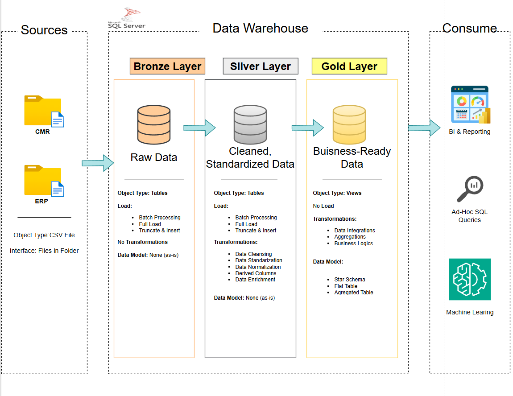
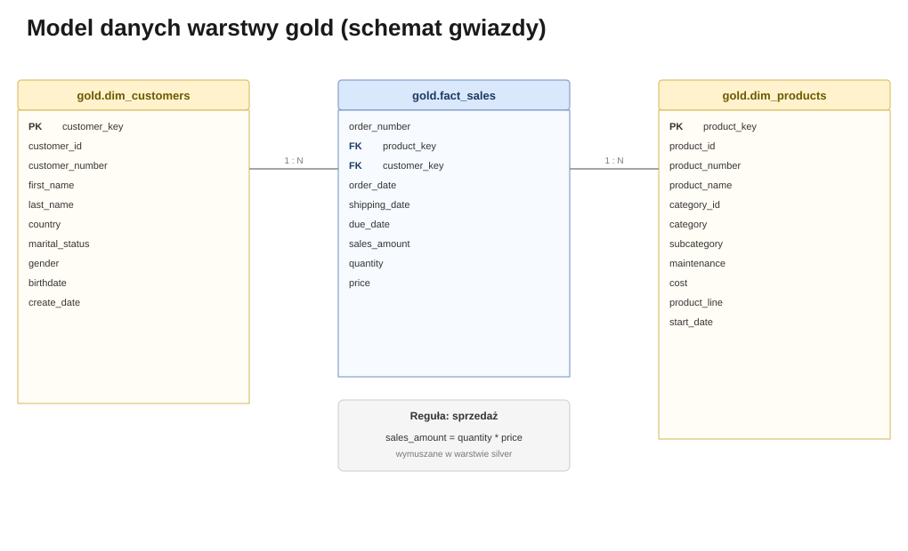

*[Read this in English](README.en.md)*

# SQL Data Warehouse: hurtownia danych od surowych CSV do modelu gwiazdy (SQL Server)

Kompletny pipeline danych zbudowany w SQL Server: od surowych plików CSV z dwóch niezależnych systemów (CRM i ERP), przez czyszczenie i standaryzację, aż po gotowy do raportowania model gwiazdy. Projekt powstał jako praktyczne ćwiczenie z inżynierii danych, budowane krok po kroku w oparciu o kurs [Data With Baraa](https://github.com/DataWithBaraa/sql-data-warehouse-project), ale kod, komentarze, testy jakości i cała dokumentacja poniżej są moje własne.

---

## Spis treści

1. [Cel projektu](#1-cel-projektu)
2. [Architektura danych](#2-architektura-danych)
3. [Źródła danych](#3-źródła-danych)
4. [Warstwa Bronze](#4-warstwa-bronze)
5. [Warstwa Silver: tu dzieje się cała robota](#5-warstwa-silver-tu-dzieje-się-cała-robota)
6. [Warstwa Gold: model gwiazdy](#6-warstwa-gold-model-gwiazdy)
7. [Testy jakości danych](#7-testy-jakości-danych)
8. [Struktura repozytorium](#8-struktura-repozytorium)
9. [Jak uruchomić projekt](#9-jak-uruchomić-projekt)
10. [Ograniczenia i dalszy rozwój](#10-ograniczenia-i-dalszy-rozwój)
11. [Użyte umiejętności](#11-użyte-umiejętności)

---

## 1. Cel projektu

Firma ma dane o klientach i sprzedaży rozrzucone w dwóch niezależnych systemach: CRM i ERP. Żeby cokolwiek policzyć (sprzedaż wg kraju, wg kategorii produktu, wg segmentu klienta), trzeba te dane najpierw połączyć w jeden spójny model, a po drodze naprawić rozjazdy: różne formaty kluczy, brakujące ceny, literówki w kodach płci czy stanu cywilnego, produkty bez daty końca ważności.

Cel: zaprojektować i zbudować hurtownię danych w architekturze medalowej (Bronze / Silver / Gold), która na końcu daje jeden, czytelny model gwiazdy gotowy pod BI i zapytania ad-hoc, bez potrzeby ręcznego czyszczenia danych za każdym razem.

## 2. Architektura danych



Trzy warstwy, każda z jasno określoną odpowiedzialnością:

- **Bronze**: surowe dane, dokładnie takie jak w plikach źródłowych. Zero transformacji. Jedyna rola tej warstwy to szybkie, powtarzalne załadowanie danych z CSV do bazy (`BULK INSERT`, pełny reload przy każdym uruchomieniu).
- **Silver**: dane po czyszczeniu, standaryzacji kodów, normalizacji formatów i naprawie ewidentnych błędów. Tu mieszka cała logika ETL.
- **Gold**: widoki SQL modelujące dane w schemat gwiazdy, gotowe do bezpośredniego odpytywania przez BI. Bez żadnego dodatkowego ładowania, bo to zwykłe widoki na dane z silver.

## 3. Źródła danych

Dwa niezależne systemy, sześć plików CSV łącznie ok. 116 tys. wierszy (patrz [`datasets/`](datasets/)):

| System | Pliki | Zawartość |
|---|---|---|
| CRM | `cust_info.csv`, `prd_info.csv`, `sales_details.csv` | klienci, produkty, pozycje zamówień sprzedażowych |
| ERP | `CUST_AZ12.csv`, `LOC_A101.csv`, `PX_CAT_G1V2.csv` | data urodzenia i płeć, kraj klienta, kategorie produktów |

Systemy nie mają wspólnego klucza w jednolitym formacie: CRM identyfikuje klienta przez `cst_key` (np. `AW00011000`), a ERP przez `cid` w dwóch różnych wariantach (`NASAW00011000` w jednym pliku, `AW-00011000` z myślnikiem w drugim). Zobacz [`docs/data_integration.svg`](docs/data_integration.svg) - to właśnie te rozjazdy trzeba było ujednolicić w warstwie silver.

## 4. Warstwa Bronze

Sześć tabel, jedna na plik źródłowy, bez żadnych przekształceń - kolumny tylko na tyle otypowane, żeby dane w ogóle się zmieściły (np. daty w `crm_sales_details` zostają jako `INT` w formacie `YYYYMMDD`, bo tak wyglądają w źródle). Ładowanie realizuje procedura `bronze.load_bronze`: dla każdej tabeli `TRUNCATE`, a potem `BULK INSERT` bezpośrednio z pliku CSV.

Pliki: [`scripts/bronze/ddl_bronze.sql`](scripts/bronze/ddl_bronze.sql), [`scripts/bronze/proc_load_bronze.sql`](scripts/bronze/proc_load_bronze.sql).

## 5. Warstwa Silver: tu dzieje się cała robota

To najważniejsza część projektu. Poniżej konkretne problemy znalezione w danych źródłowych i sposób, w jaki procedura `silver.load_silver` je rozwiązuje ([`scripts/silver/proc_load_silver.sql`](scripts/silver/proc_load_silver.sql)):

| Problem w danych | Rozwiązanie |
|---|---|
| Ten sam klient ma kilka rekordów w `crm_cust_info` (aktualizacje nadpisujące się w czasie) | `ROW_NUMBER() OVER (PARTITION BY cst_id ORDER BY cst_create_date DESC)`, bierzemy tylko najnowszy wiersz |
| Stan cywilny i płeć zakodowane jako pojedyncze litery (`S`, `M`, `F`) | `CASE` tłumaczący kody na czytelne wartości (`Single`, `Married`, `Female`...), z `n/a` dla nierozpoznanych |
| Produkty w `crm_prd_info` nie mają daty końca ważności, tylko kolejne wiersze z nową datą startu | `LEAD()` liczy datę końca jako dzień przed startem następnej wersji tego samego produktu |
| `sls_sales` bywa `NULL`, ujemna albo niezgodna z `quantity * price` | przeliczenie na nowo z `quantity * ABS(price)`, gdy oryginalna wartość jest podejrzana |
| `sls_price` bywa `NULL` albo ujemna | dowyliczenie z `sales / quantity`, gdy ceny brakuje |
| Część identyfikatorów klienta w ERP ma zbędny prefiks `NAS` | `SUBSTRING` odcinający prefiks, żeby dopasować format do CRM |
| Kod kraju w ERP niespójny (`DE`, `US` / `USA`, puste stringi) | `CASE` mapujący na pełne nazwy krajów, puste i `NULL` na `n/a` |
| Data urodzenia w przyszłości | ustawiana na `NULL` zamiast zostawiania błędnej wartości |

Wszystkie te reguły są jednocześnie egzekwowane przez testy w [`tests/quality_checks_silver.sql`](tests/quality_checks_silver.sql), więc regresję widać od razu.

## 6. Warstwa Gold: model gwiazdy



Dwa wymiary i jedna tabela faktów, jako widoki SQL (nie fizyczne tabele - w tej skali danych nie ma powodu, żeby je materializować):

- `gold.dim_customers`: łączy CRM (dane podstawowe) z ERP (kraj, data urodzenia, uzupełnienie płci, gdy CRM jej nie zna).
- `gold.dim_products`: bieżąca wersja każdego produktu (`prd_end_dt IS NULL`) wzbogacona o kategorię i podkategorię z ERP.
- `gold.fact_sales`: pozycje zamówień połączone z obydwoma wymiarami przez klucze surogatne, nie przez naturalne identyfikatory ze źródła.

Pełny katalog kolumn: [`docs/data_catalog.md`](docs/data_catalog.md). Konwencje nazewnictwa użyte w całym projekcie: [`docs/naming_conventions.md`](docs/naming_conventions.md). Przepływ danych między warstwami: [`docs/data_flow.svg`](docs/data_flow.svg).

## 7. Testy jakości danych

Dwa zestawy zapytań kontrolnych, każde z jasno opisanym oczekiwanym wynikiem:

- [`tests/quality_checks_silver.sql`](tests/quality_checks_silver.sql): duplikaty i `NULL`-e w kluczach głównych, niepożądane spacje, spójność `sales = quantity * price`, zakresy dat.
- [`tests/quality_checks_gold.sql`](tests/quality_checks_gold.sql): unikalność kluczy surogatnych w wymiarach, integralność referencyjna między `fact_sales` a wymiarami (brak "sierocych" kluczy).

## 8. Struktura repozytorium

```
sql-data-warehouse/
│
├── datasets/                    # surowe pliki CSV (CRM i ERP)
│   ├── source_crm/
│   └── source_erp/
│
├── docs/                        # dokumentacja i diagramy
│   ├── data_architecture.png
│   ├── data_flow.svg
│   ├── data_integration.svg
│   ├── data_model.svg
│   ├── data_catalog.md
│   └── naming_conventions.md
│
├── scripts/                     # skrypty SQL
│   ├── init_database.sql
│   ├── bronze/
│   ├── silver/
│   └── gold/
│
├── tests/                       # kontrole jakości danych
│
├── README.md
└── README.en.md
```

## 9. Jak uruchomić projekt

1. Wymagany SQL Server (wystarczy edycja Express) oraz SQL Server Management Studio.
2. Uruchom [`scripts/init_database.sql`](scripts/init_database.sql): zakłada bazę `DataWarehouse` i trzy schematy.
3. Uruchom skrypty DDL warstwy bronze i silver ([`scripts/bronze/ddl_bronze.sql`](scripts/bronze/ddl_bronze.sql), [`scripts/silver/ddl_silver.sql`](scripts/silver/ddl_silver.sql)), żeby założyć puste tabele.
4. W [`scripts/bronze/proc_load_bronze.sql`](scripts/bronze/proc_load_bronze.sql) podmień ścieżki w `BULK INSERT` na lokalną ścieżkę do folderu `datasets` po sklonowaniu repozytorium, a następnie uruchom skrypt i wywołaj `EXEC bronze.load_bronze;`.
5. Uruchom [`scripts/silver/proc_load_silver.sql`](scripts/silver/proc_load_silver.sql) i wywołaj `EXEC silver.load_silver;`.
6. Uruchom [`scripts/gold/ddl_gold.sql`](scripts/gold/ddl_gold.sql), żeby założyć widoki warstwy gold.
7. Opcjonalnie: przejdź przez skrypty w `tests/`, żeby zweryfikować jakość danych.

## 10. Ograniczenia i dalszy rozwój

- Projekt celowo nie historyzuje danych (poza `crm_prd_info`, gdzie historię wymusza samo źródło) - każde uruchomienie robi pełny reload, nie SCD.
- Brak automatycznego harmonogramu (np. SQL Server Agent) - ładowanie jest ręczne, przez wywołanie procedur.
- Kolejny naturalny krok: warstwa raportowa na `gold.fact_sales` (np. w Power BI) - dane są już w kształcie gotowym pod taki dashboard.

## 11. Użyte umiejętności

T-SQL (widoki, procedury składowane, `ROW_NUMBER`, `LEAD`, `BULK INSERT`) · projektowanie architektury medalowej (Bronze/Silver/Gold) · modelowanie gwiazdy (klucze surogatne, wymiary, fakty) · czyszczenie i standaryzacja danych · pisanie testów jakości danych · dokumentowanie modelu danych i konwencji nazewnictwa.

---

**LinkedIn:** [Kamil Krzosek](https://www.linkedin.com/in/kamil-krzosek-b17921418/)
